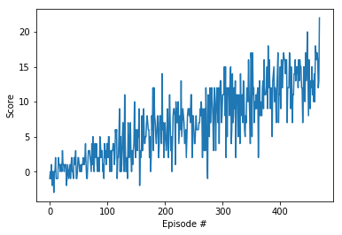

# Project 1
To solve the this task the Deep Q Network (DQN) is applied. It is a deep neural network as an approximator of a Q-table.

## Q Learning
Q-learning is a reinforcement learning technique, that solves model-free, continuous tasks. The goal is to maximize the future reward. In traditional approaches, there is a Q-table that is adapted to the collected experience (*state, action, reward, next state, done*). For each state-action combination a Q-value is saved in the Q-table. After each episode is played, the Q-values of state-action combinations that are experienced in the episode will be updated.

The disadvantage of the traditional approach is, that the Q-table exceeds memory capacities with increasing state and action dimensions. The idea of DQN is approximate the Q-table with a deep neural network.

## DQN Network
The DQN architecture:

  + Input state size(37 nodes) 
  + Relu
  + Hidden layer(64 nodes)
  + Relu
  + Hidden layer(64 nodes)
  + Output action size(4 nodes)

## Hyperparameters
The following hyperparameters are used.

  + BUFFER_SIZE = int(1e5)  		# replay buffer size
  + BATCH_SIZE = 64  				# minibatch size
  + GAMMA = 0.99  		# discount factor
  + TAU = 1e-3  		# for soft update of target parameters
  + LR = 5e-4  			# learning rate
  + UPDATE_EVERY = 4  # how often to update the network
  + eps_start = 1.0	# starting value of epsilon, for epsilon-greedy action selection
  + eps_end = 0.01 	# minimum value of epsilon
  + eps_decay = 0.995	# multiplicative factor (per episode) for decreasing epsilon

## Results
  Environment solved in 369 episodes!	Average Score: 13.01
  
  
## Future Work
Try more complex network architectures or different hyperparameters combinations, would solve this environment in fewer episodes.

Implement a double DQN, a dueling DQN, or prioritized experience replay for improving the agent's performance.

Try to train an agent from raw pixels.