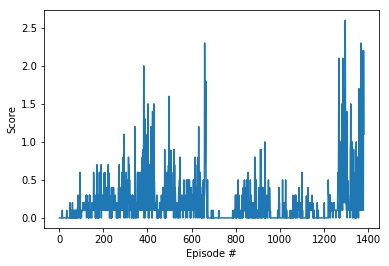

# Project 3
The task is a cooperative task. The aim is to keep the ball in play as long as possible to reach the max reward above 0.5 from the two agents. It is suitable to apply the same agent to both agents. To solve the this task Deep Deterministic Policy Gradients (DDPG) is applied. It is a off-policy and model-free along with Deep Q-Networks RL algorithm.

## DDPG
DDPG is a policy gradient algorithm that uses a stochastic behavior policy for good exploration but estimates a deterministic target policy. Policy gradient algorithms utilize a form of policy iteration: they evaluate the policy, and then follow the policy gradient to maximize performance. DDPG is an actor-critic algorithm, it primarily uses two neural networks, one for the actor and one for the critic. These networks compute action predictions for the current state and generate a temporal-difference (TD) error signal each time step. The input of the actor network is the current state, and the output is a single real value representing an action chosen from a continuous action space. The critic’s output is simply the estimated Q-value of the current state and of the action given by the actor. The critic network is updated from the gradients obtained from the TD error signal.

Using a much higher TAU to learn more from the latest experience, improves the agents' performance

## DDPG Network
The DDPG architecture:

**Actor (Policy) Model**

  + Input (state size nodes)
  + Relu
  + Hidden layer(400 nodes)
  + Relu
  + Hidden layer(300 nodes)
  + Tanh
  + Output (action size nodes)

**Critic (Value) Model**

  + Input (state size nodes) 
  + Relu
  + Hidden layer concatenate with action (400 nodes + action size) 
  + Relu
  + Hidden layer (300 nodes)
  + Estimated Q-value (1 node)

## Hyperparameters
The following hyperparameters are used.

+ BUFFER_SIZE = int(1e5)  # replay buffer size
+ BATCH_SIZE = 128        # minibatch size
+ GAMMA = 0.99            # discount factor
+ TAU = .6                # for soft update of target parameters
+ LR_ACTOR = 1e-4         # learning rate of the actor 
+ LR_CRITIC = 1e-3        # learning rate of the critic

## Results
  Environment solved in 1280 episodes!	Average Score: 0.51
  
  
## Future Work
Use a real multi-agent approach like MADDPG, if it would speed up the learning process.

## References

[Deep Deterministic Policy Gradients in TensorFlow](https://pemami4911.github.io/blog/2016/08/21/ddpg-rl.html), Patrick Emami, 2016